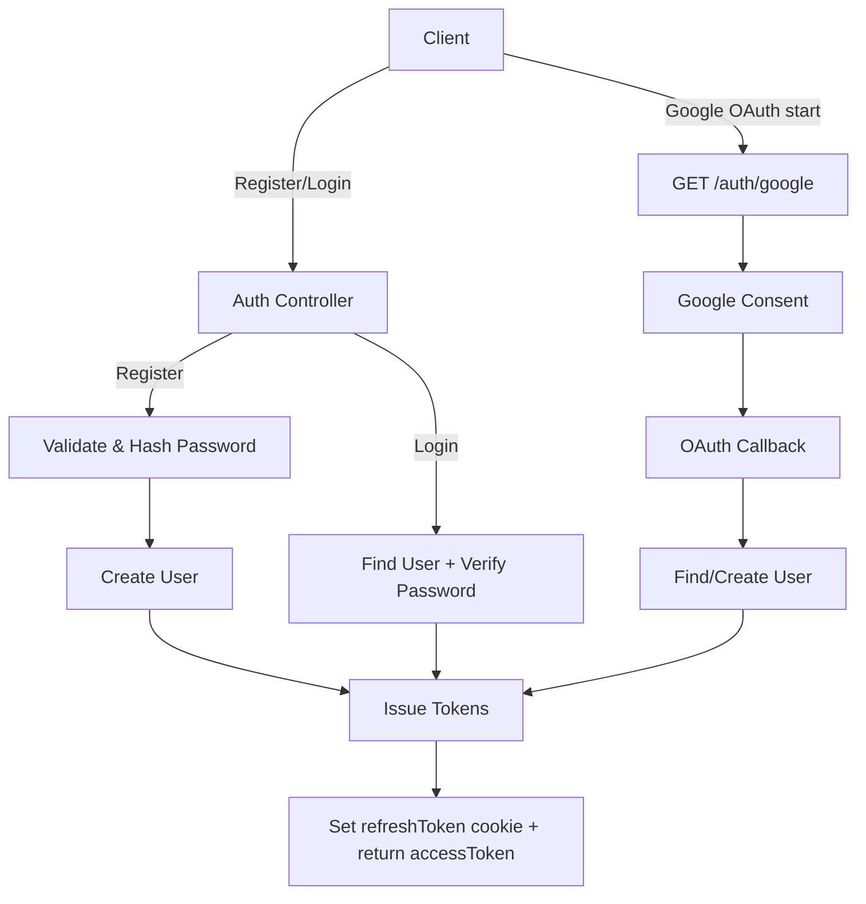
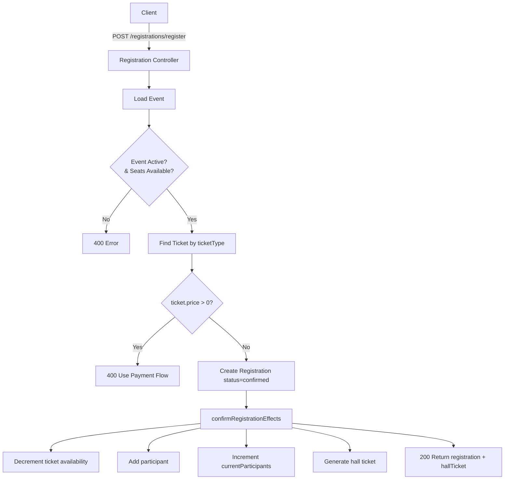
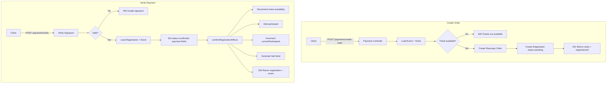
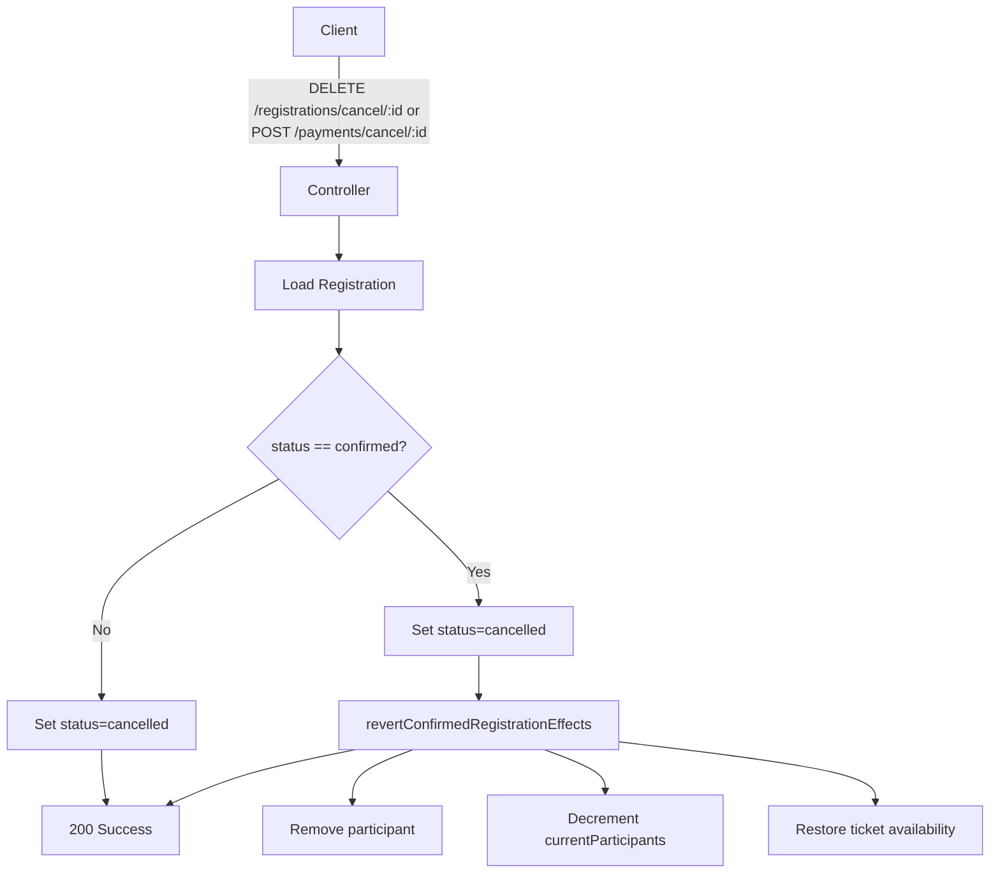
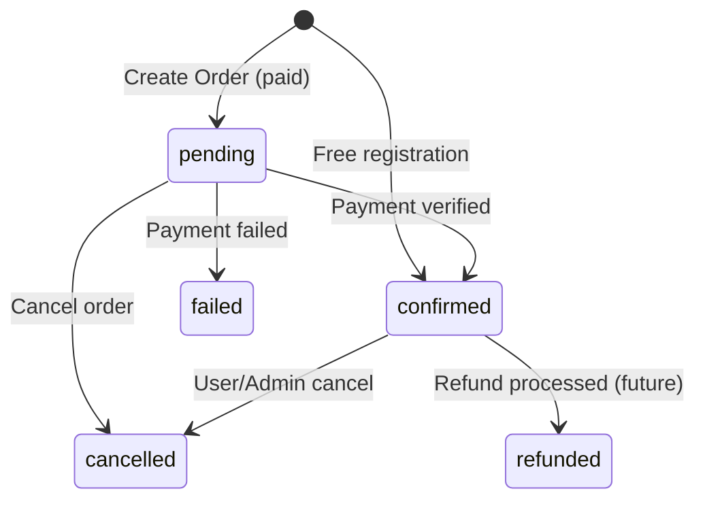

## Backend Flow Diagrams

### Authentication


### Event Registration (Free vs Paid)


### Payment (Paid Tickets)


### Cancellation


### Status Lifecycle


### Shared Side Effects
```mermaid
flowchart TD
  subgraph confirmRegistrationEffects
    A[Registration] --> B[Event]
    B --> C[Find ticketIndex]
    C --> D[available = max(0, available - 1)]
    A --> E[Generate hall ticket if missing]
    B --> F[Add participant if absent]
    B --> G[currentParticipants += 1]
  end

  subgraph revertConfirmedRegistrationEffects
    A2[Registration] --> B2[Event]
    B2 --> C2[Find ticketIndex]
    C2 --> D2[available += 1]
    B2 --> E2[Remove participant]
    B2 --> F2[currentParticipants = max(0, current - 1)]
  end
```

Notes:
- Free tickets are confirmed immediately; paid tickets require order + verification.
- All participant/count/ticket updates and hall ticket generation are centralized.

